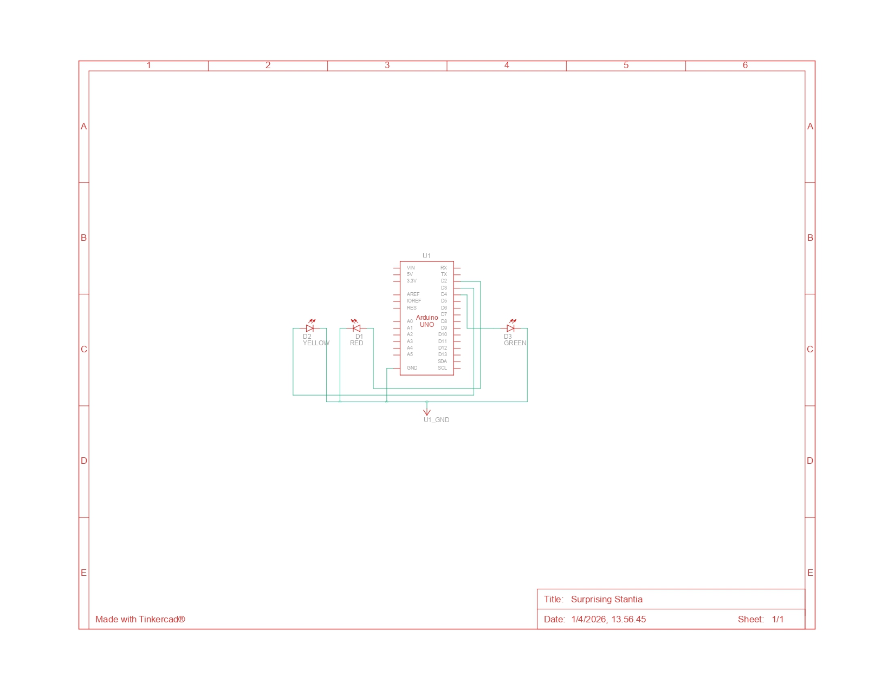

### 1. Skema Rangkaian (Schematic) LED Berjalan

Rankaian schematic 3 LED


---

### 2. Bagaimana program membuat efek LED berjalan dari kiri ke kanan?

Efek LED berjalan dari kiri ke kanan dibuat menggunakan **perulangan `for` pertama**:

```cpp
for (int ledPin = 2; ledPin < 5; ledPin++)
````

Penjelasan:

* Perulangan dimulai dari pin 2 sampai sebelum pin 5 (artinya pin 2, 3, dan 4)
* Setiap pin akan:

  * Dinyalakan (`HIGH`)
  * Diberi jeda (`delay(timer)`)
  * Dimatikan kembali (`LOW`)
* Setelah itu, pindah ke pin berikutnya (increment `ledPin++`)

Karena perpindahan ini terjadi dengan cepat dan berurutan, LED terlihat seperti **bergerak dari kiri ke kanan**.

---

### 3. Bagaimana program membuat LED kembali dari kanan ke kiri?

Efek kembali dari kanan ke kiri dibuat menggunakan **perulangan `for` kedua**:

```cpp
for (int ledPin = 7; ledPin >= 2; ledPin--)
```

Penjelasan:

* Perulangan dimulai dari pin tertinggi (pin 7) sampai pin 2
* Setiap LED:

  * Dinyalakan
  * Diberi jeda
  * Dimatikan kembali
* Nilai pin berkurang (`ledPin--`) sehingga arah bergerak berlawanan

Hasilnya, LED tampak seperti **bergerak mundur dari kanan ke kiri**.

---

### 4. Dokumentasi Program (Penjelasan Kode)

```markdown
# Dokumentasi Program LED: Efek Bolak-Balik (Running LED)

Program ini mengatur LED agar menyala secara berurutan dari kiri ke kanan, kemudian kembali dari kanan ke kiri. Efek ini sering disebut sebagai "running LED bolak-balik".

## Penjelasan Kode Baris per Baris

- `int timer = 100;`
  Variabel untuk menyimpan durasi delay dalam milidetik. Nilai kecil membuat LED bergerak lebih cepat.

- `void setup() {`
  Fungsi yang dijalankan sekali saat Arduino pertama kali aktif.

- `for (int ledPin = 2; ledPin < 5; ledPin++) {`
  Perulangan untuk menginisialisasi pin 2 sampai 4 sebagai output.

- `pinMode(ledPin, OUTPUT);`
  Mengatur setiap pin dalam perulangan sebagai output.

- `}`
  Penutup perulangan `for`.

- `}`
  Penutup fungsi setup.

- `void loop() {`
  Fungsi utama yang akan berjalan terus menerus.

- `for (int ledPin = 2; ledPin < 5; ledPin++) {`
  Perulangan untuk menyalakan LED dari kiri ke kanan (pin kecil ke besar).

- `digitalWrite(ledPin, HIGH);`
  Menyalakan LED pada pin yang sedang diproses.

- `delay(timer);`
  Memberikan jeda agar LED terlihat menyala.

- `digitalWrite(ledPin, LOW);`
  Mematikan LED sebelum pindah ke pin berikutnya.

- `for (int ledPin = 7; ledPin >= 2; ledPin--) {`
  Perulangan kedua untuk arah sebaliknya (kanan ke kiri).

- `digitalWrite(ledPin, HIGH);`
  Menyalakan LED pada pin saat ini.

- `delay(timer);`
  Memberikan jeda agar efek terlihat.

- `digitalWrite(ledPin, LOW);`
  Mematikan LED sebelum pindah ke pin sebelumnya.

- `}`
  Penutup perulangan kedua (arah kanan ke kiri).

- `}`
  Penutup perulangan pertama.

- `}`
  Penutup fungsi loop.


## Kesimpulan Alur Program

1. LED menyala berurutan dari pin 2 → 3 → 4
2. Setelah itu langsung menjalankan pola dari pin 7 → 2
3. Proses ini terus diulang
4. Hasil akhirnya adalah efek LED bergerak bolak-balik dengan cepat
```

```
