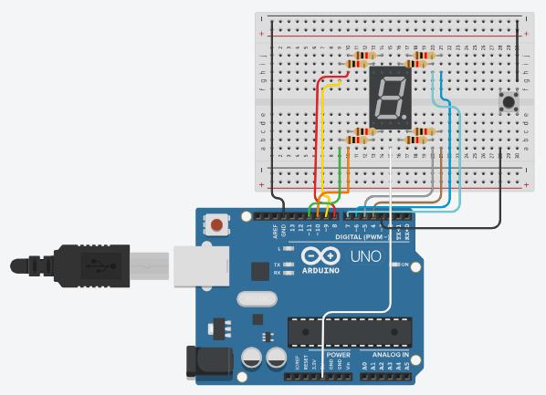
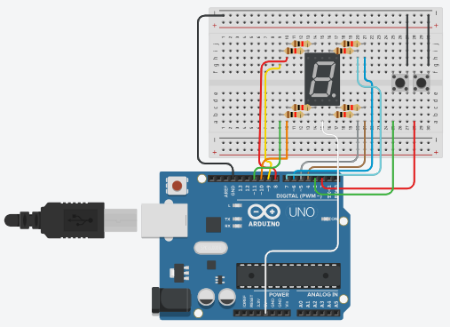

# Pertanyaan Praktikum

## 1. Gambarkan rangkaian schematic yang digunakan pada percobaan!



---

## 2. Mengapa pada push button digunakan mode INPUT_PULLUP pada Arduino Uno?

Apa keuntungannya dibandingkan rangkaian biasa?

**Jawab :**
Mode `INPUT_PULLUP` pada Arduino Uno digunakan untuk mengaktifkan resistor internal agar pin input tidak berada dalam kondisi mengambang (floating). Dengan mode ini, pin akan secara default bernilai HIGH karena terhubung ke 5V dari dalam. Hal ini membuat pembacaan digital lebih stabil dan tidak mudah terganggu. Selain itu, kelebihannya adalah tidak perlu menambahkan resistor eksternal, sehingga rangkaian menjadi lebih sederhana.

---

## 3. Jika salah satu LED segmen tidak menyala, apa saja kemungkinan penyebabnya dari sisi hardware maupun software?

**Jawab :**
LED pada seven segment bisa tidak menyala karena beberapa faktor dari hardware maupun software. Dari sisi hardware, penyebabnya bisa berupa LED yang rusak, kabel jumper yang longgar, pemasangan resistor yang tidak tepat, atau kesalahan menghubungkan pin common anode/cathode ke VCC atau ground sehingga arus tidak mengalir. Sementara dari sisi software, masalah biasanya terjadi karena salah menentukan nomor pin, kesalahan logika pada array (HIGH/LOW), lupa mengatur pin sebagai output di `pinMode()`, atau adanya konflik penggunaan pin dengan fungsi lain.

---

## 4. Modifikasi rangkaian dan program dengan dua push button yang berfungsi sebagai

penambahan (increment) dan pengurangan (decrement) pada sistem counter dan
berikan penjelasan disetiap baris kode nya dalam bentuk README.md!
<<<<<<< HEAD

=======

**Jawab :**

Gambar rangkaian schematic


---

### Kode dan Penjelasan

```cpp
#include <Arduino.h> // Library utama Arduino

// Pin untuk setiap segmen 
const int segmentPins[8] = {7, 6, 5, 11, 10, 8, 9, 4};

// Pin tombol
const int btnUp = 2;     // tombol tambah
const int btnDown = 3;   // tombol kurang


// Pola angka 0 - F (1 = ON untuk common cathode)
byte digitPattern[16][8] = {
  {1,1,1,1,1,1,0,0}, //0
  {0,1,1,0,0,0,0,0}, //1
  {1,1,0,1,1,0,1,0}, //2
  {1,1,1,1,0,0,1,0}, //3
  {0,1,1,0,0,1,1,0}, //4
  {1,0,1,1,0,1,1,0}, //5
  {1,0,1,1,1,1,1,0}, //6
  {1,1,1,0,0,0,0,0}, //7
  {1,1,1,1,1,1,1,0}, //8
  {1,1,1,1,0,1,1,0}, //9
  {1,1,1,0,1,1,1,0}, //A
  {0,0,1,1,1,1,1,0}, //b
  {1,0,0,1,1,1,0,0}, //C
  {0,1,1,1,1,0,1,0}, //d
  {1,0,0,1,1,1,1,0}, //E
  {1,0,0,0,1,1,1,0}  //F
};

// Variabel menyimpan angka saat ini
int currentDigit = 0;

// Menyimpan kondisi tombol sebelumnya (untuk deteksi tekan)
bool lastUpState = HIGH;
bool lastDownState = HIGH;


// Fungsi untuk menampilkan angka ke seven segment
void displayDigit(int num)
{
  // Loop semua segmen
  for(int i=0; i<8; i++)
  {
    digitalWrite(segmentPins[i], digitPattern[num][i]);
  }
}


void setup()
{
  // Set semua pin segmen sebagai output
  for(int i=0; i<8; i++)
  {
    pinMode(segmentPins[i], OUTPUT);
  }

  // Set tombol sebagai input pullup (default HIGH)
  pinMode(btnUp, INPUT_PULLUP);
  pinMode(btnDown, INPUT_PULLUP);

  // Tampilkan angka awal
  displayDigit(currentDigit);
}


void loop()
{
  // Membaca kondisi tombol
  bool upState = digitalRead(btnUp);
  bool downState = digitalRead(btnDown);

  //  TOMBOL UP (INCREMENT)
  // Deteksi perubahan dari HIGH ke LOW (tombol ditekan)
  if(lastUpState == HIGH && upState == LOW)
  {
    currentDigit++;              // tambah nilai
    if(currentDigit > 15)        // jika lebih dari F
      currentDigit = 0;          // kembali ke 0

    displayDigit(currentDigit);  // tampilkan
  }

  // TOMBOL DOWN (DECREMENT)
  if(lastDownState == HIGH && downState == LOW)
  {
    currentDigit--;              // kurangi nilai
    if(currentDigit < 0)         // jika kurang dari 0
      currentDigit = 15;         // kembali ke F

    displayDigit(currentDigit);  // tampilkan
  }

  // Simpan kondisi terakhir tombol
  lastUpState = upState;
  lastDownState = downState;
}
```

