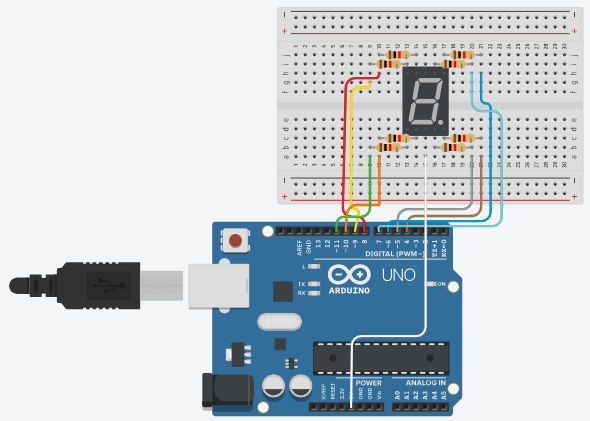

# Pertanyaan Praktikum

## 1. Gambarkan rangkaian schematic yang digunakan pada percobaan!



---

## 2. Apa yang terjadi jika nilai num lebih dari 15?

**Jawab :**
Jika nilai num pada fungsi `displayDigit` lebih dari 15, maka perulangan for tidak akan dijalankan. Sebaliknya, jika perulangan for tersebut dihilangkan atau langsung menggunakan `digitalWrite`, program akan mengalami error karena array `digitPattern` hanya memiliki indeks sampai 15.

---

## 3. Apakah program ini menggunakan common cathode atau common anode? Jelaskan alasanya!

**Jawab :**
Pada praktikum ini kita memakai seven segment tipe common anode, karena pin-pinnya terhubung ke VCC (5V). Jadi memang harus disesuaikan dengan jenis ini, agar rangkaian dapat berfungsi

---

## 4. Modifikasi program agar tampilan berjalan dari F ke 0 dan berikan penjelasan disetiap baris kode nya dalam bentuk README.md!

**Jawab :**
Kode Program dan Penjelasan

```cpp
#include <Arduino.h> // Library utama Arduino

// Menentukan pin untuk masing-masing segmen (a, b, c, d, e, f, g, dp)
const int segmentPins[8] = {7, 6, 5, 11, 10, 8, 9, 4};

// Pola nyala segmen untuk angka 0 sampai F
// 1 = mati, 0 = nyala (karena common anode)
byte digitPattern[16][8] = {
  {1,1,1,1,1,1,0,0}, //0
  {0,1,1,0,0,0,0,0}, //1
  {1,1,0,1,1,0,1,0}, //2
  {1,1,1,1,0,0,1,0}, //3
  {0,1,1,0,0,1,1,0}, //4
  {1,0,1,1,0,1,1,0}, //5
  {1,0,1,1,1,1,1,0}, //6
  {1,1,1,0,0,0,0,0}, //7
  {1,1,1,1,1,1,1,0}, //8
  {1,1,1,1,0,1,1,0}, //9
  {1,1,1,0,1,1,1,0}, //A
  {0,0,1,1,1,1,1,0}, //b
  {1,0,0,1,1,1,0,0}, //C
  {0,1,1,1,1,0,1,0}, //d
  {1,0,0,1,1,1,1,0}, //E
  {1,0,0,0,1,1,1,0}  //F
};

// Fungsi untuk menampilkan angka ke seven segment
void displayDigit(int num)
{
  // Loop untuk semua segmen (a sampai dp)
  for(int i=0; i<8; i++){
    // Kirim sinyal ke pin (dibalik karena common anode)
    digitalWrite(segmentPins[i], !digitPattern[num][i]);
  }
}

void setup()
{
  // Mengatur semua pin sebagai output
  for(int i=0; i<8; i++)
  {
    pinMode(segmentPins[i], OUTPUT);
  }
}

void loop()
{
  // Perulangan dari 15 (F) sampai 0
  for(int i=15; i>=0; i--)
  {
    displayDigit(i);   // tampilkan angka
    delay(1000);       // tunggu 1 detik
  }
}
```
