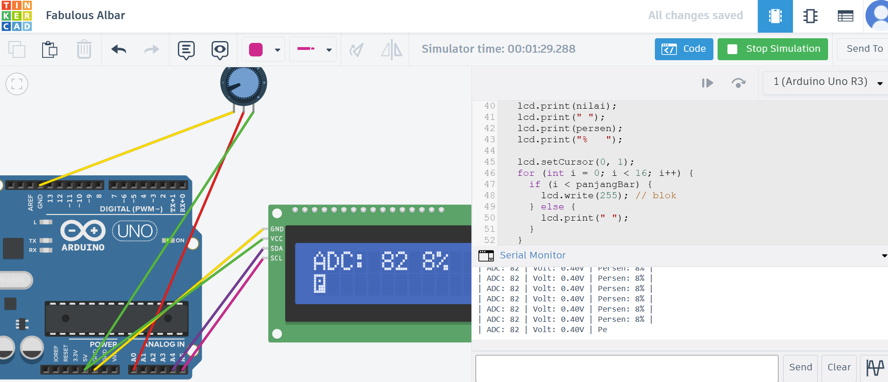

# Pertanyaan Praktikum Inter Integrated Circuit (I2C)

---

## 1. Jelaskan bagaimana cara kerja komunikasi I2C antara Arduino dan LCD pada rangkaian tersebut!

**Jawaban :**
Komunikasi I2C pada rangkaian ini memanfaatkan dua jalur utama, yaitu SDA dan SCL. Dalam sistem ini, Arduino berperan sebagai master, sedangkan LCD menjadi slave dengan alamat 0x27. Arduino terlebih dahulu membaca nilai dari potensiometer, kemudian mengirimkan data serta perintah ke LCD melalui library Wire dan LiquidCrystal_I2C dalam bentuk byte secara serial. Selanjutnya, modul I2C backpack seperti PCF8574 akan mengonversi data serial tersebut menjadi sinyal paralel, sehingga LCD dapat menampilkan nilai ADC dan bar secara langsung.

---

## 2. Apakah pin potensiometer harus seperti itu? Jelaskan yang terjadi apabila pin kiri dan pin kanan tertukar!

**Jawaban :**
Tidak, karena penempatan GND di kiri dan VCC di kanan hanya memengaruhi arah perubahan nilai saja. Jika kedua pin itu ditukar, potensiometer tetap dapat berfungsi seperti biasa, namun hasil pembacaan ADC akan menjadi kebalikan. Artinya, ketika sebelumnya diputar ke arah tertentu nilai meningkat, kini justru akan menurun, karena perubahan tegangan pada pin tengah menjadi berlawanan (dari tinggi ke rendah atau sebaliknya).

---

## 3. Modifikasi program dengan menggabungkan antara UART dan I2C (keduanya sebagai output)

### Ketentuan:

* Data tidak hanya ditampilkan di LCD tetapi juga di Serial Monitor
* Format data pada Serial Monitor:

| ADC: 0 | Volt: 0.00V | Persen: 0% |
| :----- | :---------- | :--------- |

* Tampilan saat potensiometer di posisi paling kiri:

  * `ADC: 0 0%` → `setCursor(0, 0)`
  * Bar (level) → `setCursor(0, 1)`

* Sertakan penjelasan di setiap baris kode

---

### Jawaban

## 🔧 Kode + Penjelasan

```cpp
#include <Wire.h>              // Library komunikasi I2C
#include <LiquidCrystal_I2C.h> // Library LCD I2C
#include <Arduino.h>           // Library dasar Arduino

LiquidCrystal_I2C lcd(0x27, 16, 2); // Inisialisasi LCD (alamat 0x27, 16x2)
const int pinPot = A0;              // Pin potensiometer

void setup() {
  Serial.begin(9600); // Memulai komunikasi Serial (UART)
  lcd.init();         // Inisialisasi LCD
  lcd.backlight();    // Menyalakan lampu LCD
}

void loop() {
  int nilaiADC = analogRead(pinPot); // Membaca nilai analog (0–1023)

  float volt = nilaiADC * (5.0 / 1023.0); // Konversi ke tegangan (Volt)

  int persen = map(nilaiADC, 0, 1023, 0, 100); // Konversi ke persen (0–100%)

  int panjangBar = map(nilaiADC, 0, 1023, 0, 16); // Panjang bar LCD (0–16)

  // OUTPUT SERIAL 
  Serial.print("| ADC: ");
  Serial.print(nilaiADC);        // Menampilkan nilai ADC

  Serial.print(" | Volt: ");
  Serial.print(volt, 2);         // Menampilkan tegangan (2 desimal)
  Serial.print("V");

  Serial.print(" | Persen: ");
  Serial.print(persen);          // Menampilkan persen
  Serial.println("% |");

  // OUTPUT LCD 
  lcd.setCursor(0, 0);           // Baris 1
  lcd.print("ADC:");
  lcd.print(nilaiADC);           // Tampilkan ADC

  lcd.print(" ");
  lcd.print(persen);             // Tampilkan persen
  lcd.print("%   ");             // Hapus sisa karakter

  lcd.setCursor(0, 1);           // Baris 2 (bar grafik)
  for (int i = 0; i < 16; i++) {
    if (i < panjangBar)
      lcd.write(byte(255));      // Blok penuh (bar)
    else
      lcd.print(" ");            // Kosong
  }

  delay(200); // Delay agar pembacaan stabil
}
```

---

## Kesimpulan

Program menampilkan data potensiometer ke **Serial Monitor (UART)** dan **LCD (I2C)** secara bersamaan sehingga lebih informatif dan real-time.

---

## 4. Lengkapi tabel berikut berdasarkan pengamatan pada Serial Monitor

### Tabel Soal

| ADC | Volt (V) | Persen (%) |
| --- | -------- | ---------- |
| 1   |          |            |
| 21  |          |            |
| 49  |          |            |
| 74  |          |            |
| 96  |          |            |

---

### Jawaban

| ADC  | Volt (V) | Persen (%) |
| ---- | -------- | ---------- |
| 0    | 0.00V    | 0%         |
| 20   | 0.10V    | 1%         |
| 41   | 0.20V    | 4%         |
| 61   | 0.30V    | 5%         |
| 82   | 0.40V    | 8%         |
| 102  | 0.50V    | 9%         |
| 123  | 0.60V    | 12%        |
| 143  | 0.70V    | 13%        |
| 164  | 0.80V    | 16%        |
| 184  | 0.90V    | 17%        |
| 205  | 1.00V    | 20%        |
| 225  | 1.10V    | 21%        |
| 246  | 1.20V    | 24%        |
| 266  | 1.30V    | 26%        |
| 286  | 1.40V    | 27%        |
| 307  | 1.50V    | 30%        |
| 327  | 1.60V    | 31%        |
| 348  | 1.70V    | 34%        |
| 368  | 1.80V    | 35%        |
| 389  | 1.90V    | 38%        |
| 409  | 2.00V    | 39%        |
| 430  | 2.10V    | 42%        |
| 450  | 2.20V    | 43%        |
| 471  | 2.30V    | 46%        |
| 491  | 2.40V    | 47%        |
| 511  | 250.V    | 49%        |
| 532  | 2.60V    | 52%        |
| :--- | :---     | :---       |
dan seterusnya....

